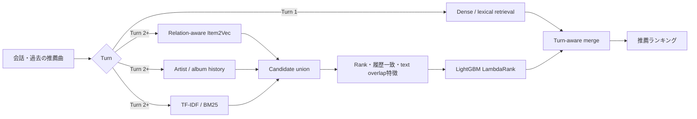

# RecSys Challenge 2026

[RecSys Challenge 2026: Music-CRS 公式サイト](http://www.recsyschallenge.com/2026/)

## コンペティション概要

RecSys Challenge 2026: Music-CRSは、対話を通じてユーザーの音楽嗜好を理解し、
楽曲を推薦する**会話型音楽推薦**のコンペティションです。システムには、過去の
会話とユーザープロファイルをもとにカタログから関連楽曲Top-20を順位付きで提示し、
その推薦理由を含む自然で一貫した応答を生成することが求められます。

1つの会話セッションは最大8ターン続きます。ここで1ターンとは、ユーザーの発話に
対してシステムが楽曲ランキングと応答を返す、1回のやり取りです。最初のTurn 1では
過去の推薦曲がまだありませんが、Turn 2以降（2〜8ターン目）では、それまでに
推薦した楽曲と会話の流れを次の推薦に利用できます。

評価は、推薦ランキングと生成応答の両面から行われます。公式の総合スコアは、
次の4指標の加重和です。

| 評価対象 | 指標 | 重み | 評価内容 |
|---|---|---:|---|
| 推薦ランキング | nDCG@20 | 0.50 | 正解楽曲を上位に推薦できているか |
| 推薦ランキング | Catalog Diversity | 0.10 | カタログ全体から幅広く推薦できているか |
| 生成応答 | Lexical Diversity | 0.10 | 推薦応答の表現に多様性があるか |
| 生成応答 | LLM-as-a-Judge | 0.30 | 応答のパーソナライズと推薦理由の品質 |

## 参加体制と私の担当

本コンペティションには、研究室メンバー計10名で構成するチーム
`uec_okmt_lab`として参加しました。
私は推薦ランキング側を担当し、特に過去の推薦履歴を利用できるTurn 2以降を
対象としたItem2Vec候補生成、複数検索手法の候補統合、特徴量設計、LightGBMによる
リランキング、turn別の評価・分析に取り組みました。

このリポジトリは、私の担当領域を技術ポートフォリオとして再構成したものです。
公開可能な合成データを用いて、会話初期と履歴が蓄積したターンを分けて扱う
候補検索＋Learning-to-Rankの二段階推薦システムを実行できます。

> このリポジトリは個人担当部分のポートフォリオ用再実装です。
> チーム全体の提出コード、Challengeデータ、Blind set、学習済みモデル、
> 外部APIで生成したembeddingは含みません。

## コンペティション結果

チーム`uec_okmt_lab`は、最終評価であるBlind Dataset Bにおいて、総合40チーム中
15位、Academic Trackでは17チーム中6位となりました。順位と評価値は
[公式最終結果](https://nlp4musa.github.io/music-crs-challenge/results.html)で公開されています。

| 区分 | 最終順位 |
|---|---:|
| 全参加チーム | **15位 / 40チーム** |
| Academic Track | **6位 / 17チーム** |

[English README](README_EN.md)

## 課題設定

最大8ターンの会話のうち、最初のTurn 1にはアイテム履歴がありません。一方、
Turn 2以降は「これまで推薦された曲」という強い逐次信号を利用できます。
全ターンに同じモデルを適用するのではなく、次の役割に分離しました。



## 私の担当範囲

- Item2VecによるTurn 2以降の候補生成
- アイテム系列とartist、album、tag、年代、会話テキストの関係学習
- TF-IDF、artist履歴検索、dense retrievalとの候補union設計
- source別の`present / inverse rank / log rank / score`特徴量
- artist・album履歴一致、query overlap、turn特徴量の設計
- KFold OOF候補を用いたreranker学習フロー
- LightGBM LambdaRankによる候補の再順位付け
- turn別Recall・Hit Rate・nDCG、候補重複、特徴量重要度の分析

## 実験で得られた知見

### Item2Vec候補検索（Dev Turn 2–8平均）

| Item2Vecの学習信号 | Recall@20 | Recall@100 | Recall@500 |
|---|---:|---:|---:|
| Item系列＋metadata | 0.2637 | 0.4370 | 0.6291 |
| User発話＋Item系列＋metadata | **0.3054** | **0.5050** | 0.6977 |
| Assistant発話＋Item系列＋metadata | 0.3006 | 0.4940 | 0.7016 |
| Music thought＋Item系列＋metadata | 0.3040 | 0.5001 | **0.7046** |

テキストは推論時のqueryへ直接混ぜるより、Item2Vec空間を作る補助関係として
利用した方が安定しました。上位候補の密度はUser発話版、広い候補回収は
Music thought版が良好でした。

### 候補プール

| Item2Vec Top-N | Artist Top-N | TF-IDF Top-N | 平均候補数 | Recall |
|---:|---:|---:|---:|---:|
| 150 | 75 | 50 | 199.8 | 0.6533 |
| 200 | 75 | 150 | 324.5 | 0.7021 |
| **300** | **100** | **200** | **460.6** | **0.7407** |
| 500 | 150 | 500 | 901.9 | 0.8003 |

候補数を増やすほどRecallは上がりますが、後段rankerの難易度と計算量も増えます。
約461件でRecall 0.7407の構成を、精度と効率の開始点としました。

### Turn-aware reranker（Dev全8 turn）

| 指標 | @20 | @100 | @500 |
|---|---:|---:|---:|
| Hit Rate | **0.3779** | 0.5711 | 0.7229 |
| nDCG | **0.1880** | 0.2237 | 0.2434 |

これはチーム環境で得た開発セット上の値です。公開デモは合成データを使うため、
この数値を再現するものではありません。

詳細な考察は[実験レポート](reports/experiment_summary.md)にまとめています。

## 実装

```text
src/turnaware_recsys/
├── item2vec.py        # metadata relationを加えたItem2Vec
├── lexical.py         # 再現用TF-IDF retriever
├── candidate_pool.py  # source別順位を保持する候補union
├── features.py        # 順位・履歴・query特徴量
├── reranker.py        # Turn 2+のLambdaRank / sklearn fallback
├── evaluation.py      # hit rate・nDCGのturn別評価
└── demo.py            # 合成データのend-to-end実行
```

## クイックスタート

Python 3.10以降を使用します。

```bash
python -m venv .venv
source .venv/bin/activate
pip install -e ".[all]"
python -m turnaware_recsys.demo
```

LightGBMを入れない場合も、scikit-learnのfallbackでrerankerを実行できます。

```bash
pip install -e ".[item2vec]"
python -m turnaware_recsys.demo
```

テスト：

```bash
pip install -e ".[dev]"
pytest -q
```

## 再現性とリーク対策

本番相当の学習では、train queryに対してKFold OOFで候補を生成し、同じqueryを
学習したretrieverの過学習スコアをrerankerへ渡さない設計を採用しました。
また、Turn 1を系列モデルの教師から除外し、`turn_number >= 2`だけでrankerを
学習します。この公開デモは処理の理解を目的とした小規模版です。

## データについて

`examples/synthetic_data.json`は、このリポジトリ専用に作成した架空の曲・会話です。
実際のChallengeデータやSpotify由来データは再配布していません。

## Acknowledgements

This work was developed from my contribution to a team entry for the ACM RecSys
Challenge 2026 Music Conversational Recommendation task. The challenge organizers,
dataset authors, official baselines, and my teammates are acknowledged for the shared
task and collaborative environment. This repository contains only my portfolio-oriented
reimplementation and aggregate experimental observations.
