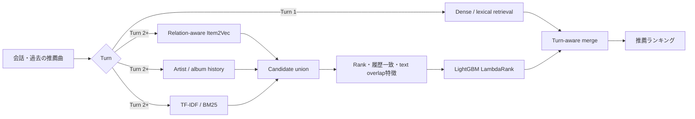

# Turn-Aware Music Recommender

会話型音楽推薦において、**会話初期と履歴が蓄積したターンを分けて扱う**、
候補検索＋Learning-to-Rankの二段階推薦システムです。

ACM RecSys Challenge 2026へのチーム参加で私が担当した、Turn 2以降の
Item2Vec候補生成、候補プール設計、LightGBMリランキング、turn別分析を、
公開用に小さく再構成しました。

> このリポジトリは個人担当部分のポートフォリオ用再実装です。
> チーム全体の提出コード、Challengeデータ、Blind set、学習済みモデル、
> 外部APIで生成したembeddingは含みません。

[English README](README_EN.md)

## 課題設定

会話型推薦では、最初のターンにはアイテム履歴がありません。一方、Turn 2以降は
「これまで推薦された曲」という強い逐次信号を利用できます。全ターンに同じモデルを
適用するのではなく、次の役割に分離しました。



## 私の担当範囲

- Item2VecによるTurn 2以降の候補生成
- アイテム系列とartist、album、tag、年代、会話テキストの関係学習
- TF-IDF、artist履歴検索、dense retrievalとの候補union設計
- source別の`present / inverse rank / log rank / score`特徴量
- artist・album履歴一致、query overlap、turn特徴量の設計
- KFold OOF候補を用いたreranker学習フロー
- LightGBM LambdaRankによる候補の再順位付け
- turn別Recall・Hit Rate・nDCG、候補重複、特徴量重要度の分析

## 実験で得られた知見

### Item2Vec候補検索（Dev Turn 2–8平均）

| Item2Vecの学習信号 | Recall@20 | Recall@100 | Recall@500 |
|---|---:|---:|---:|
| Item系列＋metadata | 0.2637 | 0.4370 | 0.6291 |
| User発話＋Item系列＋metadata | **0.3054** | **0.5050** | 0.6977 |
| Assistant発話＋Item系列＋metadata | 0.3006 | 0.4940 | 0.7016 |
| Music thought＋Item系列＋metadata | 0.3040 | 0.5001 | **0.7046** |

テキストは推論時のqueryへ直接混ぜるより、Item2Vec空間を作る補助関係として
利用した方が安定しました。上位候補の密度はUser発話版、広い候補回収は
Music thought版が良好でした。

### 候補プール

| Item2Vec Top-N | Artist Top-N | TF-IDF Top-N | 平均候補数 | Recall |
|---:|---:|---:|---:|---:|
| 150 | 75 | 50 | 199.8 | 0.6533 |
| 200 | 75 | 150 | 324.5 | 0.7021 |
| **300** | **100** | **200** | **460.6** | **0.7407** |
| 500 | 150 | 500 | 901.9 | 0.8003 |

候補数を増やすほどRecallは上がりますが、後段rankerの難易度と計算量も増えます。
約461件でRecall 0.7407の構成を、精度と効率の開始点としました。

### Turn-aware reranker（Dev全8 turn）

| 指標 | @20 | @100 | @500 |
|---|---:|---:|---:|
| Hit Rate | **0.3779** | 0.5711 | 0.7229 |
| nDCG | **0.1880** | 0.2237 | 0.2434 |

これはチーム環境で得た開発セット上の値です。公開デモは合成データを使うため、
この数値を再現するものではありません。

詳細な考察は[実験レポート](reports/experiment_summary.md)にまとめています。

## 実装

```text
src/turnaware_recsys/
├── item2vec.py        # metadata relationを加えたItem2Vec
├── lexical.py         # 再現用TF-IDF retriever
├── candidate_pool.py  # source別順位を保持する候補union
├── features.py        # 順位・履歴・query特徴量
├── reranker.py        # Turn 2+のLambdaRank / sklearn fallback
├── evaluation.py      # hit rate・nDCGのturn別評価
└── demo.py            # 合成データのend-to-end実行
```

## クイックスタート

Python 3.10以降を使用します。

```bash
python -m venv .venv
source .venv/bin/activate
pip install -e ".[all]"
python -m turnaware_recsys.demo
```

LightGBMを入れない場合も、scikit-learnのfallbackでrerankerを実行できます。

```bash
pip install -e ".[item2vec]"
python -m turnaware_recsys.demo
```

テスト：

```bash
pip install -e ".[dev]"
pytest -q
```

## 再現性とリーク対策

本番相当の学習では、train queryに対してKFold OOFで候補を生成し、同じqueryを
学習したretrieverの過学習スコアをrerankerへ渡さない設計を採用しました。
また、Turn 1を系列モデルの教師から除外し、`turn_number >= 2`だけでrankerを
学習します。この公開デモは処理の理解を目的とした小規模版です。

## データについて

`examples/synthetic_data.json`は、このリポジトリ専用に作成した架空の曲・会話です。
実際のChallengeデータやSpotify由来データは再配布していません。

## Acknowledgements

This work was developed from my contribution to a team entry for the ACM RecSys
Challenge 2026 Music Conversational Recommendation task. The challenge organizers,
dataset authors, official baselines, and my teammates are acknowledged for the shared
task and collaborative environment. This repository contains only my portfolio-oriented
reimplementation and aggregate experimental observations.

